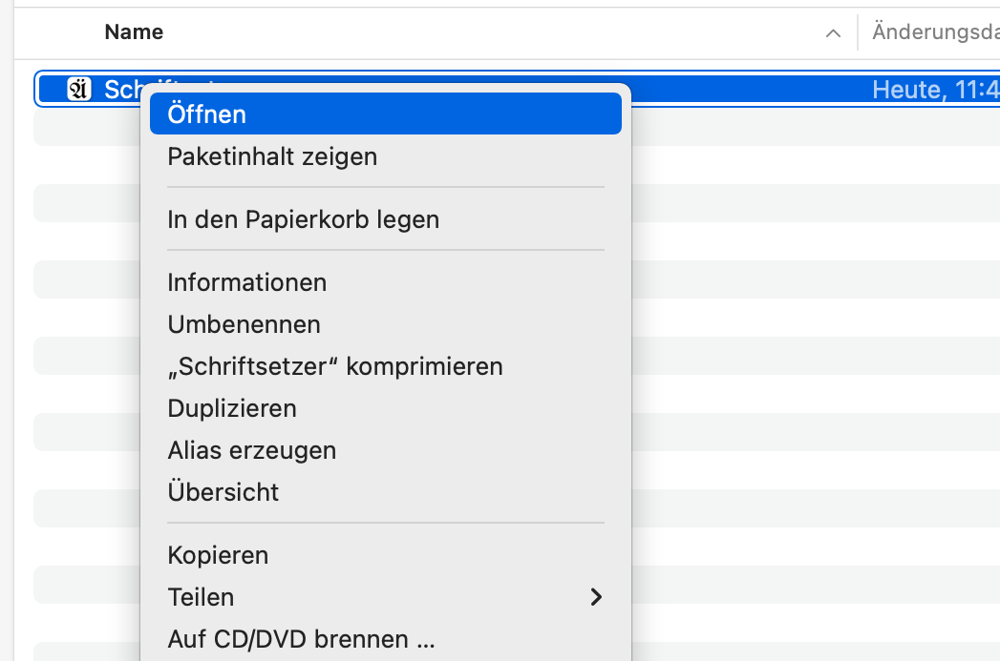
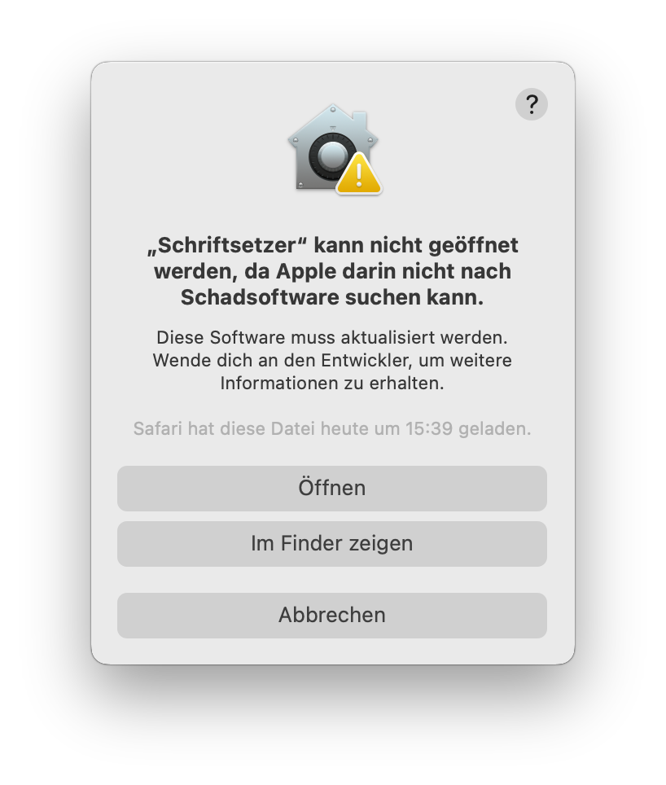

<!--- cSpell:locale en, de --->

# Schriftsetzer

[[en](README.md)] | [de] | [[ja](README-ja.md)]

Dies ist die Eingabemethode, die die [german-postfix](https://github.com/emacs-mirror/emacs/blob/master/lisp/leim/quail/latin-post.el#L1148)-Bindungen unter macOS implementiert.

## Eigenschaften

Man kann die Umlautbuchstaben und Eszett und das Euro-Zeichen mit den unten dargestellten Tastenfolgen eingeben.

| Input | Output |
| ----- | ------ |
| ae    | ä      |
| aee   | ae     |
| oe    | ö      |
| oee   | oe     |
| ue    | ü      |
| uee   | ue     |
| sz    | ß      |
| szz   | sz     |
| AE    | Ä      |
| AEE   | AE     |
| OE    | Ö      |
| OEE   | OE     |
| UE    | Ü      |
| UEE   | UE     |
| SZ    | ẞ      |
| SZZ   | SZ     |
| E=    | €      |
| E==   | E=     |

Außerdem sind die folgenden Eingänge durch.

- ge
- que
- aue
- eue
- Que
- Aue
- Eue

## Systemumgebung

Die geprüften Umgebungen sind wie folgt:

- macOS 12.6.1
- intel mac

Das muss mit Apple-Silizium funktioniert, aber das wurde nicht bestätigt.

## Installieren

1. Die App [herunterladen](https://github.com/sumomoneko/Schriftsetzer/releases).
2. In `~/Library/Input Methods` stellen.
3. Diese App wurde nicht notariell beglaubigt und kann nicht in der vorliegenden Form bearbeitet werden[^1].  
   Um den Systemschutz zu umgehen, öffnen Sie die eingesetzte App über das Kontextmenü und
   wählen Sie im Dialogfeld "Öffnen". (zu diesem Zeitpunkt geschieht nichts).  
   s. [Sicher Apps auf dem Mac öffnen - Apple Support (DE)](https://support.apple.com/de-de/HT202491)  
     
   
4. Folgen `Systemeinstellungen -> Tastatur -> Eingabequellen → + Schaltfläche`, und `Deutsch german-postfix` hinzufügen.

[^1]:
    Im Allgemeinen stellen Unsignierte Programme ein Sicherheitsrisiko dar.
    Insbesondere können Eingabemethoden alle Tastenanschläge, einschließlich Passwörter und PINs, ausspähen.
    Installieren Sie keine App, wenn Sie ihr nicht vertrauen.

## Lizenz

- MIT
- Symbol: [UnifrakturMaguntia - Google Fonts](https://fonts.google.com/specimen/UnifrakturMaguntia/about)

## Literaturangaben

- [多言語タイピング Wiki - atwiki（アットウィキ）](https://w.atwiki.jp/multilingual/)
- [mozc/Info.plist at master · google/mozc](https://github.com/google/mozc/blob/master/src/mac/Info.plist)
- [003 info plist · GreenYun/Zhengma-macOS Wiki](https://github.com/GreenYun/Zhengma-macOS/wiki/003-info-plist)
- [🌓 入力モード - みずぴー日記](https://mzp.hatenablog.com/entry/2017/10/26/084053)
- [日本語入力を作るときに必要だった本 - SKK = すごく かしこく かわいい - BOOTH](https://mzp.booth.pm/items/809262)
- [ensan-hcl/macOS_IMKitSample_2021: InputMethodKit Sample App with macOS12, Xcode13, Swift5.6 in 2022.](https://github.com/ensan-hcl/macOS_IMKitSample_2021)
- [emacs/latin-post.el at master · emacs-mirror/emacs](https://github.com/emacs-mirror/emacs/blob/master/lisp/leim/quail/latin-post.el#L1148)
- [tonsky/Universal-Layout: Пакет из английской и русской раскладок, спроектированных для удобного совместного использования](https://github.com/tonsky/Universal-Layout)
