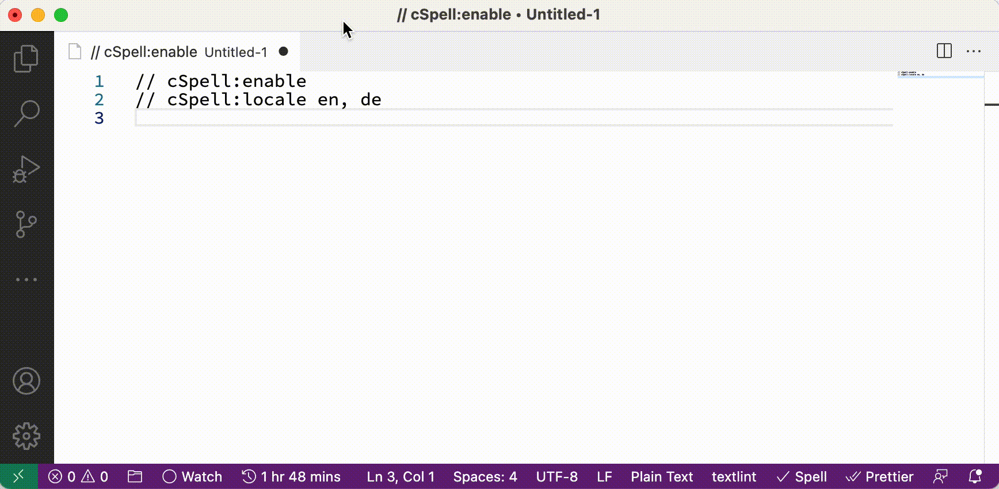

# Schriftsetzer

[[en](README.md)] | [[de](README-de.md)] | [ja]

macOS で [german-postfix](https://github.com/emacs-mirror/emacs/blob/master/lisp/leim/quail/latin-post.el#L1148) バインドを実装する Input Method です。

## 機能

ウムラウトやエスツェットなどドイツ語アルファベット固有の文字とユーロ記号を、以下に示すキーシーケンスで入力出来るようにします。

| 入力 | 出力 |
| ---- | ---- |
| ae   | ä    |
| aee  | ae   |
| oe   | ö    |
| oee  | oe   |
| ue   | ü    |
| uee  | ue   |
| sz   | ß    |
| szz  | sz   |
| AE   | Ä    |
| AEE  | AE   |
| OE   | Ö    |
| OEE  | OE   |
| UE   | Ü    |
| UEE  | UE   |
| SZ   | ẞ    |
| SZZ  | SZ   |
| E=   | €    |
| E==  | E=   |

また、以下の入力はスルーします。

- ge
- que
- aue
- eue
- Que
- Aue
- Eue

## 動作環境

確認した環境は以下の通り:

- macOS 12.6.1
- intel mac

Apple シリコンでも動作すると思われますが、未確認です。

## インストール方法

1. アプリを[ダウンロード](https://github.com/sumomoneko/Schriftsetzer/releases)
2. `~/ライブラリ/Input Methods` に配置
3. 本アプリはノータリゼーション (公証) を受けておらず、そのままでは実行できません[^1]。
   システム保護を回避するため、配置したアプリをコンテキステメニューから開き、ダイアログで「開く」を選択します。(このとき、何も起きません)  
   s.a. [Mac で App を安全に開く - Apple サポート (日本)](https://support.apple.com/ja-jp/HT202491)  
     
   
4. `システム環境設定 → キーボード → 入力ソース → + ボタン` から `ドイツ語 german-postfix`を追加  
   

[^1]:
    一般に、未署名のプログラムはセキュリティ上危険があります。
    特に Input Method は、パスワード・暗証番号などを含む全てのキー入力をのぞき見することが出来ます。
    本プログラムを含め、信頼できない場合はインストールしないでください。

## ライセンス

- MIT
- アイコンイメージ: [UnifrakturMaguntia - Google Fonts](https://fonts.google.com/specimen/UnifrakturMaguntia/about)

## 参考文献

- [多言語タイピング Wiki - atwiki（アットウィキ）](https://w.atwiki.jp/multilingual/)
- [mozc/Info.plist at master · google/mozc](https://github.com/google/mozc/blob/master/src/mac/Info.plist)
- [003 info plist · GreenYun/Zhengma-macOS Wiki](https://github.com/GreenYun/Zhengma-macOS/wiki/003-info-plist)
- [🌓 入力モード - みずぴー日記](https://mzp.hatenablog.com/entry/2017/10/26/084053)
- [日本語入力を作るときに必要だった本 - SKK = すごく かしこく かわいい - BOOTH](https://mzp.booth.pm/items/809262)
- [ensan-hcl/macOS_IMKitSample_2021: InputMethodKit Sample App with macOS12, Xcode13, Swift5.6 in 2022.](https://github.com/ensan-hcl/macOS_IMKitSample_2021)
- [emacs/latin-post.el at master · emacs-mirror/emacs](https://github.com/emacs-mirror/emacs/blob/master/lisp/leim/quail/latin-post.el#L1148)
- [tonsky/Universal-Layout: Пакет из английской и русской раскладок, спроектированных для удобного совместного использования](https://github.com/tonsky/Universal-Layout)
