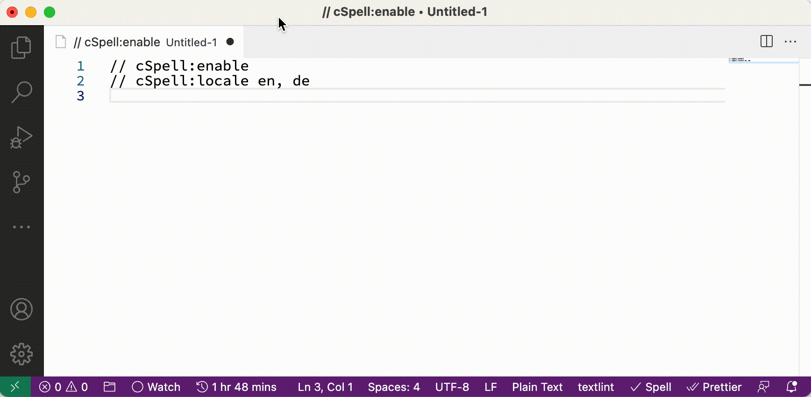
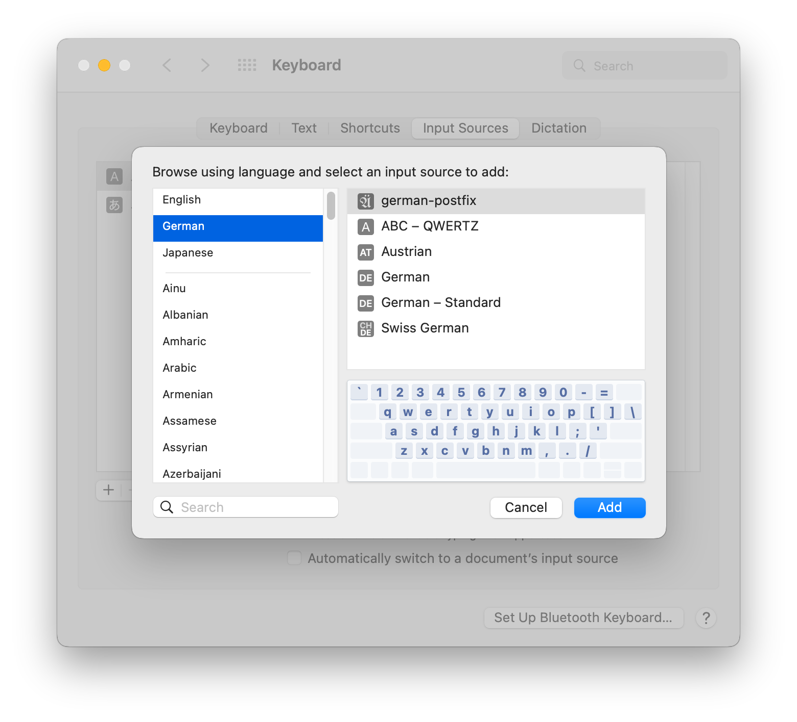

# Schriftsetzer

[en] | [[de](README-de.md)] | [[ja](README-ja.md)]

This is an Input Method that implements [german-postfix](https://github.com/emacs-mirror/emacs/blob/master/lisp/leim/quail/latin-post.el#L1148) bindings on macOS.

## Features

You can enter the unique characters of the German alphabet and the Euro sign with the key sequence shown below:

| inputs | outputs |
| ------ | ------- |
| ae     | ä       |
| aee    | ae      |
| oe     | ö       |
| oee    | oe      |
| ue     | ü       |
| uee    | ue      |
| sz     | ß       |
| szz    | sz      |
| AE     | Ä       |
| AEE    | AE      |
| OE     | Ö       |
| OEE    | OE      |
| UE     | Ü       |
| UEE    | UE      |
| SZ     | ẞ       |
| SZZ    | SZ      |
| E=     | €       |
| E==    | E=      |

In addition, the following inputs are through:

- ge
- que
- aue
- eue
- Que
- Aue
- Eue

## Operating environment

The environment checked is as follows:

- macOS 12.6.1
- intel mac

It may work with Apple silicon, but not been confirmed.

## How to Install

1. [Download](https://github.com/sumomoneko/Schriftsetzer/releases) the app.
2. Place in `~/Library/Input Methods`
3. Follow `System Preferences → Keyboard → Input Sources → + button`, and add `German german-postfix`.
4. Log out and log in again

## License

- MIT
- Icon Images: [UnifrakturMaguntia - Google Fonts](https://fonts.google.com/specimen/UnifrakturMaguntia/about)

## References

- [多言語タイピング Wiki - atwiki（アットウィキ）](https://w.atwiki.jp/multilingual/)
- [mozc/Info.plist at master · google/mozc](https://github.com/google/mozc/blob/master/src/mac/Info.plist)
- [003 info plist · GreenYun/Zhengma-macOS Wiki](https://github.com/GreenYun/Zhengma-macOS/wiki/003-info-plist)
- [🌓 入力モード - みずぴー日記](https://mzp.hatenablog.com/entry/2017/10/26/084053)
- [日本語入力を作るときに必要だった本 - SKK = すごく かしこく かわいい - BOOTH](https://mzp.booth.pm/items/809262)
- [ensan-hcl/macOS_IMKitSample_2021: InputMethodKit Sample App with macOS12, Xcode13, Swift5.6 in 2022.](https://github.com/ensan-hcl/macOS_IMKitSample_2021)
- [emacs/latin-post.el at master · emacs-mirror/emacs](https://github.com/emacs-mirror/emacs/blob/master/lisp/leim/quail/latin-post.el#L1148)
- [tonsky/Universal-Layout: Пакет из английской и русской раскладок, спроектированных для удобного совместного использования](https://github.com/tonsky/Universal-Layout)
